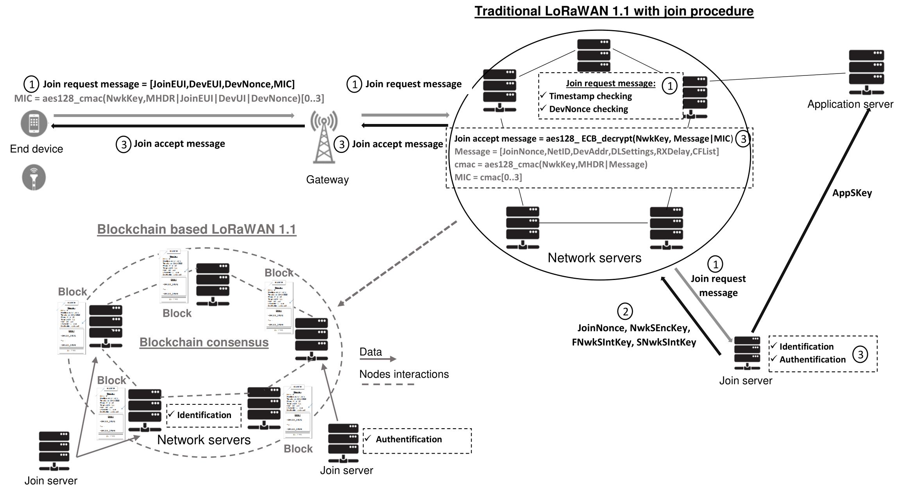
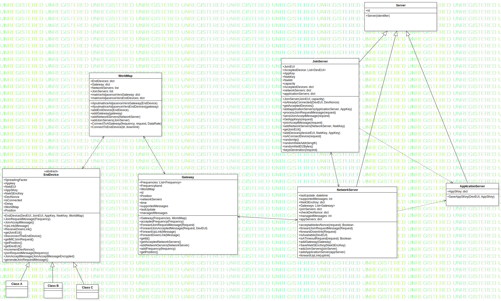

# LoRaSIM Simulator
## LoRaSIM Simulator
This package provides a simulator of the LoRaWAN 1.1 protocol and a simulator of the LoRaWAN protocol using the PoI-based blockchain for identification.

This simulator generates a LoRaWAN topology where end devices can join the network by performing a join procedure.
<p align="center">
  
</p>

Main contact: Lounès Meddahi (lounes.meddahi@gmail.com)

## Overview
The PoI-based blockchain LoRaWAN architecture aims to process the join procedure in the network servers instead of the join servers. For this, the join servers send their data (DevEUI associated to end devices authorized to connect the network) to the network servers wich create blocks to compose the blockchain.
<p align="center">
  
</p>


## Implementation 
To implement the LoRaWAN simulator we have provided an object-oriented implementation in python.
<p align="center">
  
</p>

The blockchain can be fin in the [Block4PoId](https://github.com/LounesMD/Block4PoId) repository.

## Paper 
The paper has been accepted at [ISNCC'23](https://www.isncc-conf.org/) and selected **Best paper award**.

## Citing 
If you use the project in your work, please consider citing it with:

```bibtex
@misc{Block4PoId,
  author = {Lounès, Meddahi and Ahmed, Meddahi and Patrick, Sondi and Fen, Zhou},
  title = {Leveraging blockchain for a robust and scalable device identification in LoRaWAN},
  year = {2023},
  journal = {IEEE 2023 International Symposium on Networks, Computers and Communications (ISNCC'23)},
}
```

## Usage

First install the requirements: `pip install -r ./requirements/requirements.txt`

To run the version with/without the blockchain (from the folder src): `python ./main_{with;without}_blockchain.py` 

N.B.: If you want to modify the positioning strategy or else, you have to modify the associated function in the right file. Like `generate_Strat_Gateway` in the file `utils/Gateway.py`.

## Example

Check the file `src/simulator_example.py` to have a short example on how instantiate the simulator.
