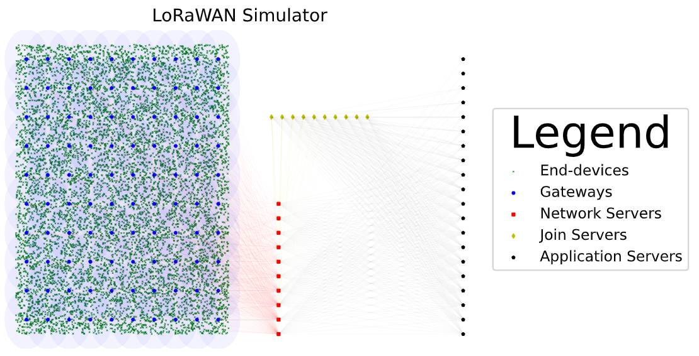

# LoRaSim
## LoRaWAN simulator
This package provides a simulator of the LoRaWAN 1.1 protocol. This simulator aims to implement the entire LoRaWAN protocol.

  

Main contact: Lounès Meddahi (lounes.meddahi@gmail.com)

## UML diagram

## Other
This repository is still in build. The latest version of the simulator will soon be upload.

